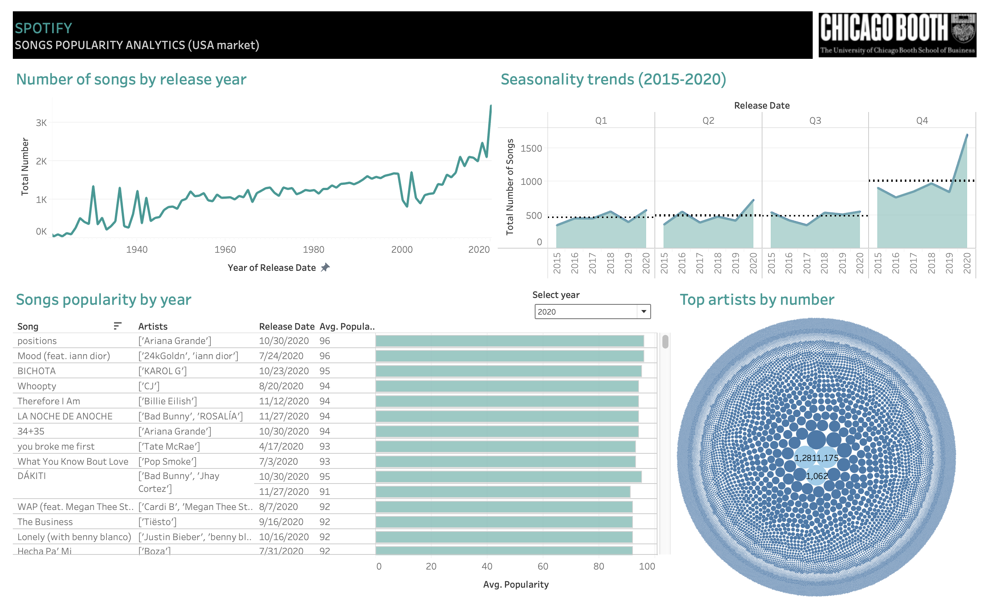

# SpotifyPopularity

The aim of this project is to research through ML tools what drives the popularity of individual songs and what different songs may have in common. While music tastes are subjective, there may be ways to answer these questions by reference to a song’s attributes, such as valence, tempo and acousticness. The end output will consist in two models: one predicting how popular a new release will be and another enabling one to create better playlists.

## Data Exploration - Initial Overview

